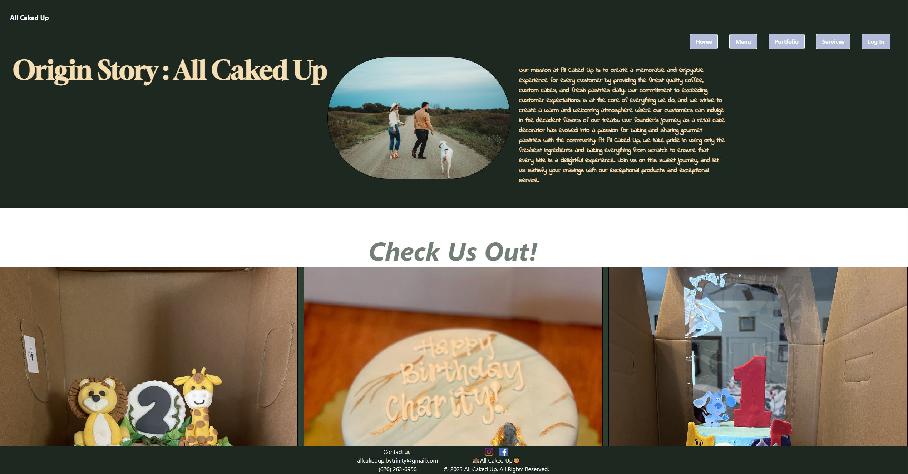

https://allcakedup.herokuapp.com/

# All Caked Up LLC

## Description

A home page that introduces the bakery and provides links to the various sections of the website.
A "Menu" page that displays a list of all our products, descriptions, and prices. Customers can filter the products by category.
Coming Soon => An "Order" page that allows customers to add products to their cart and place an order. Customers can select the quantity of each product they wish to order and enter their contact and delivery information. The website will calculate the total cost of the order and display it to the customer before they confirm the order.
A "Contact Us" section that provides our contact information.
A "Portfolio" page that displays a catalog of All Caked Up Products and capabilities to satisfy customers.

## Table of Contents

- [Installation](#installation)
- [Usage](#usage)
- [Credits](#credits)
- [License](#license)

## Installation

To run this website on your local machine, you will need to have Node.js and npm installed.
Clone the repository from GitHub:
bash
Copy code
git clone https://github.com/your-username/bakery-website.git
Navigate to the project directory and install the dependencies:
bash
Copy code
cd bakery-website
npm install
Start the development server:
sql
Copy code
npm start
Open your browser and navigate to http://localhost:3000 to view the website.

## Usage

Main functionality is to create an E-Commerce application for the bakery

## Credits

Youtube, KU TA's and Instructors, Google

Mitchell:
measterling13
https://github.com/measterling13
easterlingme95@gmail.com

Vess:
angel-pup
https://github.com/angel-pup
vess.stewart@pm.me

Zane:
NicholsZane13
https://github.com/NicholsZane13
nichols.zane16@gmail.com

Riley:
krrahe
https://github.com/krrahe
rilrahe@gmail.com

## License

Licensed under the  license

---

🏆

## Badges

## Features

Dependencies
This project uses the following dependencies:
React
React Router
Bootstrap
Font Awesome
React Bootstrap
React Icons
Node
Apollo
Tailwind

## Contributing

## Tests

## Questions

If there is any questions, please feel free to contact me. My name is Zane Nichols, and my email is nichols.zane16@gmail.com.
If you'd like to check out any of my other work, check out my github profile at NicholsZane13
